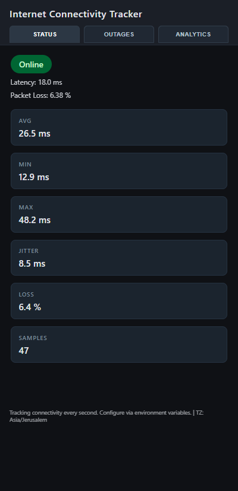
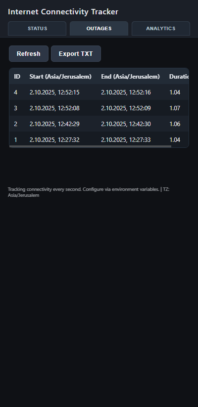
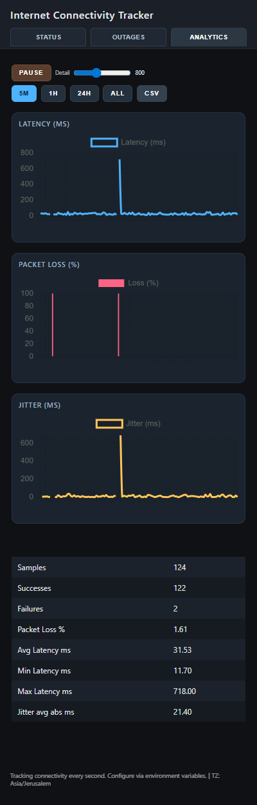

<p align="center">
  
</p>

<h1 align="center">Internet Connectivity Tracker</h1>

<p align="center">
  <strong>A lightweight, self-hosted web application to monitor your internet connectivity, track outages, and analyze network performance.</strong>
</p>

<p align="center">
  
</p>

<p align="center">
  <em>Monitor. Detect. Analyze. Export. All in one lightweight container.</em>
</p>

## ✨ Features

- **Real‑time Monitoring:** Sub‑second customizable interval (default 1s) for continuous reachability + latency sampling.
- **Smart Outage Detection:** Threshold-based failure / recovery logic with precise duration calculation.
- **Deep Metrics:** Live latency, min/max/avg, jitter (mean absolute delta), success/failure counts, packet loss %.
- **High‑Performance UI:** Web Worker offloads aggregation + downsampling (LTTB) for smooth charts even with tens of thousands of points.
- **Webhook Diagnostics:** Built-in example outage and direct test webhook button make integrations easy to validate.
- **Interactive Analytics:** Time range controls (5m / 1h / 24h / All) with dynamic decimation slider and pause/resume.
- **Resilient Streaming:** Server-Sent Events (SSE) with auto-reconnect and state reseeding after backend restarts.
- **Data Export:** One-click CSV (metrics) and TXT (outages) exports with both UTC and localized timestamps.
- **Timezone Aware:** Honors `TZ` environment variable; UI labels adapt automatically.
- **Lightweight Footprint:** Single small container (FastAPI + SQLite) — no external services required.
- **Stateless Frontend:** All computation reproducible from server history; worker can be reseeded at any time.
- **Easy Extensibility:** Clean endpoints + modular code allow adding alerts, webhooks, Prometheus, etc.

## 🧭 Architecture at a Glance

```
 ┌──────────────────────────────────────────────────────────┐
 │                          Browser                        │
 │  UI (Chart.js)  ◄── Worker (buffer, metrics, LTTB)      │
 │        ▲                       ▲                        │
 │        │updates (postMessage)  │SSE samples             │
 └────────┼───────────────────────┼────────────────────────┘
     │                       │
     ▼                       ▼
   FastAPI Backend  ── async monitor loop ── ping/http checks
     │
     ▼
  SQLite DB (latency_samples, outages)
```

Key performance choices:
- Circular buffer + downsampling in Worker keeps UI fast.
- SSE sends only new samples; page can recover fully after outage using reseed fetch.
- All times stored UTC; localized on output.

## 🚀 Quick Start

### Prerequisites

- Python 3.8+
- An internet connection to install dependencies

### Local Installation

1.  **Clone the repository:**
    ```bash
    git clone https://github.com/your-username/internet-tracker.git
    cd internet-tracker
    ```

2.  **Create and activate a virtual environment:**
    ```bash
    python -m venv .venv
    source .venv/bin/activate
    ```

3.  **Install the dependencies:**
    ```bash
    pip install -r requirements.txt
    ```

4.  **Run the application:**
    ```bash
    uvicorn app.main:app --reload
    ```

5.  **Open your browser** and navigate to `http://localhost:8000`.

### Docker Deployment (Recommended)

1.  **Build the Docker image:**
    ```bash
    docker build -t internet-tracker .
    ```

2.  **Run the Docker container:**
  ```bash
  docker run --name internet-tracker -p 8000:8000 internet-tracker
  ```

  Or use Docker Compose (recommended for volumes / env management):
  ```bash
  cp docker-compose.example.yml docker-compose.yml
  cp .env.example .env   # then edit .env if needed
  docker compose up -d
  ```
  Edit `docker-compose.yml` or `.env` to change targets, intervals, timezone, or enable webhooks.

## ⚙️ Configuration

The application can be configured using environment variables. You can create a `.env` file in the project root directory to store your configuration.

| Variable | Description | Default |
| -------- | ----------- | ------- |
| `CHECK_INTERVAL` | Interval in seconds between checks | `1` |
| `TARGET_HOST` | Host/IP or URL target (single-service mode) | `8.8.8.8` |
| `CHECK_METHOD` | `ping` or `http` | `ping` |
| `FAIL_THRESHOLD` | Consecutive fails to open outage | `2` |
| `RECOVER_THRESHOLD` | Consecutive successes to close outage | `2` |
| `DB_PATH` | SQLite path (inside container) | `/data/data.sqlite3` |
| `TZ` | Local timezone for output | `UTC` |
| `MULTI_SERVICES` | JSON array of service definitions (see below) | *(unset)* |
| `ALERT_WEBHOOK_URL` | Optional webhook endpoint for outage events | *(unset)* |
| `ALERT_WEBHOOK_SEND_END` | Also send outage end event | `true` |
| `ALERT_WEBHOOK_TIMEOUT` | Webhook request timeout seconds | `5` |
| `ALERT_WEBHOOK_TEST_URL` | Override default test webhook destination | *(preset demo URL)* |
| `SPEEDTEST_ENABLED` | Enable periodic speedtest collection | `false` |
| `SPEEDTEST_INTERVAL` | Seconds between speedtest runs | `1800` |
| `SPEEDTEST_SERVICE` | Service name bucket for speedtest samples | `default` |
| `LOG_LEVEL` | Python log level | `INFO` |

### Timezone Behavior
All timestamps are stored internally in UTC. API responses include both UTC and localized forms where appropriate:

- Outages export: `Start (UTC)`, `Start (Local)`, `End (UTC)`, `End (Local)`
- Metrics CSV: `ts_utc`, `ts_local`
- Streaming events: `ts` (UTC) + `ts_local`

Change timezone by setting `TZ` (e.g. `Europe/Berlin`, `Asia/Jerusalem`). Invalid zones fall back to UTC.

### Multi‑Service Mode

Instead of single `TARGET_HOST` you can define multiple services:

```
MULTI_SERVICES='[
  {"name":"dns","method":"ping","target":"8.8.8.8","interval":1},
  {"name":"web","method":"http","target":"https://example.com","interval":5}
]'
```

Each object supports: `name`, `method`, `target`, `interval`, `fail_threshold`, `recover_threshold` (optional overrides). The first service (or `service` query param) is used by the legacy UI views.

### Webhook Alerts

Enable outage event webhooks by setting `ALERT_WEBHOOK_URL`. By default only the outage **end** event is sent (so you get one notification per outage with the full duration). Set `ALERT_WEBHOOK_SEND_START=true` if you also want a start notification when an outage first opens. Use the Settings tab buttons to send an example outage or the dedicated **Send Test Webhook** action, which posts a synthetic `outage.end` payload to the configurable test target (defaults to the hosted n8n demo URL, override with `ALERT_WEBHOOK_TEST_URL`).

Key variables:
| Variable | Purpose | Default |
| -------- | ------- | ------- |
| `ALERT_WEBHOOK_URL` | Destination HTTP endpoint (POST JSON) | *(unset)* |
| `ALERT_WEBHOOK_SEND_END` | Send outage end event | `true` |
| `ALERT_WEBHOOK_SEND_START` | Send outage start event | `false` |
| `ALERT_WEBHOOK_TIMEOUT` | Request timeout seconds | `5` |
| `ALERT_WEBHOOK_TEST_URL` | Destination for Send Test Webhook button | `https://n8n.urielmz.com/webhook-test/77cc4c77-1f99-415f-8ba6-e275effc04b7` |

Events:

`outage.start` payload fields:
```
event, service, outage_id, start_time, start_time_local, target, method, interval, fail_threshold, recover_threshold
```

`outage.end` adds:
```
end_time, end_time_local, duration_seconds
```

Testing / diagnostics (Settings tab or API):
```
POST /api/webhook/test?event=start   # may be skipped if start disabled
POST /api/webhook/test?event=end
POST /api/webhook/example-outage     # simulates a ~37s outage (sends end only unless start enabled)
POST /api/webhook/test-external      # Send Test Webhook button helper (outage.end payload)
GET  /api/webhook/status
```
The example outage helper is useful when you only send end events: you can validate your integration still receives a realistic `outage.end` without waiting for a real outage.
GET  /api/webhook/status
```

### Adding a .env (optional)
Create a `.env` and reference it in `docker-compose.yml` or load manually:

```
CHECK_INTERVAL=1
TARGET_HOST=8.8.4.4
FAIL_THRESHOLD=3
RECOVER_THRESHOLD=2
TZ=Asia/Jerusalem
```


## 🖼️ Screenshots

| Status Tab                                       | Outages Tab                                        | Analytics Tab                                      |
| ------------------------------------------------ | -------------------------------------------------- | -------------------------------------------------- |
|  |  |  |

## 📡 API Endpoints

The application provides a RESTful API for accessing connectivity data.

| Method | Endpoint | Description | Notes |
| ------ | -------- | ----------- | ----- |
| GET | `/api/status` | Current monitor state + last outage | Includes `tz` |
| GET | `/api/outages` | List outages (latest first) | Local timestamp fields included |
| GET | `/api/outages/export` | TXT export (UTC + Local) | Attachment |
| GET | `/api/metrics?range=5m` | Metrics + samples (filtered) | Ranges: 5m,1h,24h,all |
| GET | `/api/metrics/export.csv` | Bulk CSV export | Includes both time forms |
| GET | `/api/trends?days=30` | Daily trends (loss/latency/outages + speedtest) | `days` min 7, max 180 |
| GET | `/api/stream/samples` | SSE with new samples | Auto-reconnect handled in UI |

Additional endpoints:

| Method | Endpoint | Description |
| ------ | -------- | ----------- |
| GET | `/api/webhook/status` | Webhook configuration & last delivery info |
| POST | `/api/webhook/test?event=start|end` | Send synthetic test webhook |
| POST | `/api/webhook/test-external` | Trigger Send Test Webhook (`outage.end` payload) |
| GET | `/api/services` | List configured services & states |

Future ideas: `/api/health`, `/api/version`, Prometheus metrics.

### Sample SSE Event
```json
{
  "id": 12345,
  "ts": "2025-10-02T12:34:56.789012+00:00",
  "ts_local": "2025-10-02T15:34:56.789012+03:00",
  "success": 1,
  "latency_ms": 12.4
}
```

## 🛠️ Technology Stack

- **Backend:** [FastAPI](https://fastapi.tiangolo.com/), [Python 3](https://www.python.org/)
- **Database:** [SQLite](https://www.sqlite.org/index.html)
- **Frontend:** HTML, CSS, JavaScript
- **Containerization:** [Docker](https://www.docker.com/)

## 🧪 Development

Run locally with auto-reload:
```bash
uvicorn app.main:app --reload
```

Format / lint (suggested tools):
```bash
pip install black isort ruff
black . && isort . && ruff check .
```

Run inside Docker while binding local `data/` volume for persistence.

### Performance Tuning
- Increase `CHECK_INTERVAL` to reduce load.
- Keep `TARGET_HOST` geographically close for lower baseline latency.
- Use `http` method if ICMP is blocked in your environment.
- Adjust decimation slider in UI for large ranges.

### Scaling & Persistence
SQLite is fine for personal / single-host usage. For long-term high-frequency retention or multi-user: migrate to Postgres and enlarge historical retention / pruning logic.

## 🔐 Security Considerations
- No authentication built-in (intended for private network / homelab). Place behind reverse proxy or add auth middleware for public exposure.
- Limit exposure of `/api/stream/samples` if sensitive.
- All inputs are controlled server-side; no user-supplied SQL.

## 🗺️ Roadmap (Ideas)
- Alerting (email, webhook, Slack, Telegram) on outage start / recovery.
- Historical aggregation rollups (hour/day averages) to reduce long-range payload sizes.
- Prometheus metrics endpoint.
- Dark mode toggle.
- Export JSON for external processing.
- Optional WebSocket transport.

## 🤝 Contributing

Contributions are welcome! If you have any ideas, suggestions, or bug reports, please open an issue or submit a pull request.

### Pull Request Guidelines
1. Open an issue first for significant changes.
2. Keep PRs small & focused.
3. Include before/after rationale for UI changes (screenshots helpful).
4. Ensure new environment variables have sane defaults.

## 🧾 License

This project is licensed under the MIT License. See the [LICENSE](LICENSE) file for details.

---

<p align="center"><sub>Built to make intermittent connectivity visible — fork it, extend it, share improvements.</sub></p>
